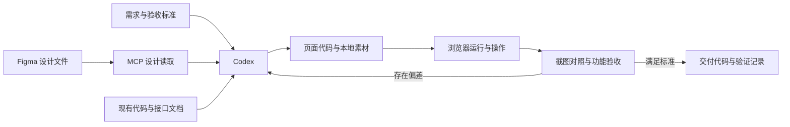
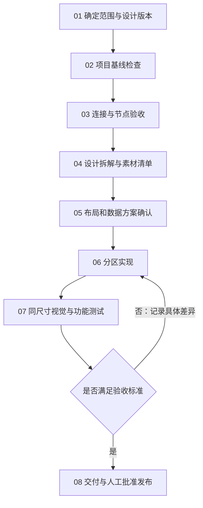

# Codex 与 Figma 协同开发实用教程

> 从环境配置、设计读取到页面验收的标准操作流程
>
> 适用读者：产品经理、设计师、项目负责人，以及首次参与前端开发的人员。  
> 适用范围：把 Figma 设计稿实现为网站或 Web 应用，也适用于已有系统的页面改版。  
> 文档核对日期：2026 年 8 月 31 日。软件入口、授权方式与调用额度可能调整，请以文末官方资料为准。

## 阅读指南

如果只是想把一个页面做出来，先读第 1—5 章，再按第 6 章的 SOP 执行。第 7 章提供可直接复制的任务模板，第 8—10 章用于验收和排错。缓存与团队化建设分别放在第 11、12 章，不必在第一次使用时全部配置。

本文中的项目名、节点编号、端口和路径均为示例。配置代码应根据自己的环境填写，不要把占位符当作真实地址。文中的流程图采用 Mermaid；不支持 Mermaid 的 Markdown 阅读器仍可通过图后的文字说明理解流程。

### 目录

- [1. 先明确这套方法能解决什么](#1-先明确这套方法能解决什么)
- [2. 工作原理与基本概念](#2-工作原理与基本概念)
- [3. 开始前需要准备什么](#3-开始前需要准备什么)
- [4. 配置 Codex 与 Figma 的连接](#4-配置-codex-与-figma-的连接)
- [5. 怎样确认已经真正接通](#5-怎样确认已经真正接通)
- [6. 从设计到上线前验收的完整 SOP](#6-从设计到上线前验收的完整-sop)
- [7. 可以直接使用的任务模板](#7-可以直接使用的任务模板)
- [8. 怎样判断还原质量](#8-怎样判断还原质量)
- [9. 素材、数据和组件的处理原则](#9-素材数据和组件的处理原则)
- [10. 常见问题与排查顺序](#10-常见问题与排查顺序)
- [11. 进阶：用缓存减少重复读取](#11-进阶用缓存减少重复读取)
- [12. 团队协作与拓展空间](#12-团队协作与拓展空间)
- [13. 安全与权限边界](#13-安全与权限边界)
- [14. 一页执行清单](#14-一页执行清单)
- [15. 参考资料](#15-参考资料)

## 1. 先明确这套方法能解决什么

Figma 决定页面的视觉目标，Codex 负责把目标落实到代码，浏览器负责检验代码运行后的真实效果。三者缺一不可。

一个页面即使与截图很像，也可能存在按钮不可用、图片加载失败、长标题溢出、滚动被遮挡等问题。反过来，接口全部正常，也不代表页面已经按设计稿还原。因此，本教程把交付质量分为三部分：

| 质量维度 | 要回答的问题 | 验证方式 |
| --- | --- | --- |
| 视觉一致性 | 布局、字体、间距、素材是否符合指定版本？ | 同尺寸截图对照 |
| 功能完整性 | 搜索、分页、弹窗、下载、提交是否正常？ | 实际操作与测试 |
| 工程可靠性 | 是否保留现有业务、能否构建、是否影响其他页面？ | 代码检查、构建与回归 |

这不是“一条链接自动生成完整系统”的流程。Figma MCP 提供结构化设计信息及代码参考，最终实现仍由编码代理结合项目完成，出现偏差也需要检查和修正。[Figma：MCP 与代理各自负责什么](https://developers.figma.com/docs/figma-mcp-server/mcp-vs-agent/)

第一次实践建议选择一个范围清楚的页面，例如“活动列表及详情入口”。先跑通一次完整流程，再扩展到整站。

## 2. 工作原理与基本概念

### 2.1 先认识几个经常出现的词

| 名称 | 通俗解释 | 在工作中的作用 |
| --- | --- | --- |
| Codex | 能在授权范围内阅读、修改和验证代码的开发助手 | 分析项目、编写页面、执行检查 |
| Figma | 存放界面设计、组件和素材的设计工具 | 提供视觉依据 |
| MCP | 工具与开发助手交换信息的一套协议 | 让 Codex 调用外部工具，而非只看聊天文字 |
| MCP 服务 | 按 MCP 协议提供能力的程序或远程服务 | 提供设计读取、截图或素材导出等工具 |
| Plugin，插件 | 打包好的扩展功能 | 可能同时包含 MCP 配置和操作指南 |
| Skill，技能 | 针对某类任务的操作规范 | 规定读取、实现和验证的顺序，不代替权限 |
| Frame，画框 | 设计稿中的一块界面画布 | 通常对应一个页面或页面状态 |
| Node，节点 | Figma 中的一个对象 | 页面、按钮、文字、图片都可能是节点 |
| Component，组件 | 可重复使用的设计或代码单元 | 例如按钮、卡片、导航项 |
| Design Token，设计变量 | 统一管理的颜色、字号、间距等值 | 减少不同页面各写一套样式 |
| API，接口 | 页面向业务系统读取或提交数据的入口 | 提供真实列表、详情、预约等业务数据 |
| Viewport，视口 | 浏览器实际用于显示网页的区域 | 决定页面在哪个宽度下验收 |

### 2.2 信息如何流动



可以把这张图理解为：先给 Codex 明确目标，再提供设计和项目资料；Codex 修改代码后，在浏览器中实际检查。发现差异就继续调整，而不是在“代码已生成”时结束。

注意，两条数据通路互不替代：

- **设计通路**：Figma → MCP → Codex，回答“页面应该长什么样”。
- **业务通路**：网页 → 业务后端，回答“页面应该显示哪些真实数据、执行什么操作”。

接通 Figma MCP，不会自动接通业务接口。完成设计还原，也不意味着拥有测试账号或业务权限。

### 2.3 为什么仅提供截图容易产生偏差

截图记录的是某个时刻的像素结果，看不到组件关系、字体文件、隐藏状态、图片裁剪参数，也无法说明按钮点击后应该做什么。

因此，实际工作应组合使用三类材料：设计结构用于确定尺寸和关系，设计截图用于核对整体观感，交互说明用于确定行为。缺少其中一项，就应在实施前列明假设。

## 3. 开始前需要准备什么

### 3.1 给执行者一份完整的任务资料

| 必备资料 | 应包含的内容 | 不清楚时怎么办 |
| --- | --- | --- |
| 最终设计链接 | 文件链接、具体节点链接、版本或日期 | 请设计师指定最终稿，不让 Codex 自行猜版本 |
| 实施范围 | 哪几个页面；PC、H5 还是两者 | 先做一个端、一个页面 |
| 项目位置 | 实际代码目录，不是只给截图文件夹 | 请开发人员确认仓库根目录 |
| 启动方式 | 安装命令、启动命令、页面地址、端口 | 让 Codex 先读取 README 和项目脚本 |
| 业务资料 | 接口文档、必要的脱敏响应示例 | 未确认字段留空，不用设计示例冒充真实数据 |
| 交互说明 | 点击跳转、表单校验、弹窗、权限规则 | 请产品负责人补充 |
| 验收条件 | 指定视口、浏览器、页面状态与允许偏差 | 开始前约定，不在交付时临时改变标准 |

测试账号应单独安全提供。不要把密码、令牌写进公开需求文档。

### 3.2 设计侧的准备

请设计师检查以下事项：

1. 最终稿有明确名称，例如“PC / 活动列表 / 已确认 / 2026-08-31”。
2. 旧稿、参考案例与最终稿分开存放。
3. 重复按钮、输入框、卡片尽量使用组件，避免每处独立绘制。
4. 字体名称、字重、授权来源清楚；需要 Web 字体时能够提供合法文件。
5. 图片和图标可以导出，组件库中的源素材也有访问权限。
6. 长文字、无数据、加载中、错误、禁用状态有设计或文字说明。
7. PC 与移动端差异明显时，分别提供对应稿，不把 PC 页面简单缩小视为 H5 设计。

清晰命名、组件、变量和 Auto Layout 有助于表达设计意图，但它们不会自动补齐缺失的业务规则。[Figma：为代码实现整理设计文件](https://developers.figma.com/docs/figma-mcp-server/structure-figma-file/)

### 3.3 项目侧的准备

修改前先让项目正常运行，并保留一个可恢复的版本。有 Git 的项目应确认当前分支和未提交改动；没有版本管理时，先由项目负责人安排备份。

不要为了做一个新页面直接复制整个项目。通常在现有工程内增加页面和组件目录即可。只有技术栈、发布方式或维护边界确实不同，才考虑独立应用。

PC 和 H5 可以采用独立页面布局，同时复用接口和数据处理。目录是否拆分是工程决策，不由“画面看起来差别很大”这一点单独决定。

## 4. 配置 Codex 与 Figma 的连接

### 4.1 先选一种方式，不要同时堆叠安装

| 方式 | 适合谁 | 授权与依赖 | 本文建议 |
| --- | --- | --- | --- |
| 官方 Figma 插件 / 远程 MCP | 大部分首次使用者 | Figma OAuth 授权；需要访问远程服务 | 优先使用 |
| 官方桌面 MCP | 确有本机选区或组织使用需求的团队 | Figma 桌面应用运行并启用服务 | 按需选择 |
| 第三方缓存 MCP | 同一份较稳定的大稿需要反复读取 | 本地运行程序、Figma PAT、缓存管理 | 基础流程稳定后再加 |

官方当前推荐远程服务，桌面服务主要面向特定组织或企业使用场景。两者并不保证拥有完全相同的功能。[Figma 远程配置](https://developers.figma.com/docs/figma-mcp-server/remote-server-installation/)、[Figma 桌面配置](https://developers.figma.com/docs/figma-mcp-server/local-server-installation/)

### 4.2 推荐方式：安装官方插件

在提供插件入口的 Codex 桌面客户端中：

1. 打开 Plugins / 插件。
2. 找到 Figma，核对提供方和权限说明后安装。
3. 按引导进入 Figma 授权页面。
4. 确认登录的是拥有目标设计文件权限的账号，再允许访问。
5. 返回 Codex，检查连接状态，并按第 5 章进行一次实际读取。

不同版本的界面文字和位置可能变化；这里的安装与授权流程依据 [Figma 官方 Codex 接入说明](https://developers.figma.com/docs/figma-mcp-server/remote-server-installation/)。若当前客户端没有该插件入口，可采用下面的手动方式。

已经安装并成功连接的插件无需再配置一个同名远程服务。重复安装会增加工具混淆和排错成本。

### 4.3 手动方式：通过 Codex CLI 添加远程 MCP

CLI 就是在终端中输入命令的使用方式。打开 PowerShell、终端或编辑器终端，先检查本机是否能运行 Codex：

```bash
codex --version
codex mcp --help
```

如果提示找不到命令，说明 CLI 尚未安装或未加入命令搜索路径。此时回到客户端插件方式，或由开发人员按官方安装说明处理；不要不断重复后面的配置命令。

已经可以使用 CLI 时，执行：

```bash
codex mcp add figma --url https://mcp.figma.com/mcp
```

如果添加后尚未完成授权，再执行：

```bash
codex mcp login figma
```

按浏览器引导完成授权，然后检查：

```bash
codex mcp list
```

添加命令来自 [Figma 官方 Codex 配置](https://developers.figma.com/docs/figma-mcp-server/remote-server-installation/)；登录与检查命令参见 [OpenAI MCP 文档](https://learn.chatgpt.com/docs/extend/mcp?surface=cli)。

### 4.4 需要理解配置文件时，再看这一节

Codex 使用 TOML 配置。默认用户配置文件为 `~/.codex/config.toml`；Windows 通常对应 `C:/Users/你的用户名/.codex/config.toml`。可信项目也可使用项目内 `.codex/config.toml`。[OpenAI MCP 配置说明](https://learn.chatgpt.com/docs/extend/mcp?surface=cli)

下面是远程服务的最小配置片段：

```toml
[mcp_servers.figma]
url = "https://mcp.figma.com/mcp"
```

实际编辑时应遵守三条原则：

- 只新增或修改对应服务配置，不覆盖整个文件。
- 已经通过命令或插件配置成功时，不重复追加相同表名。
- 修改后按客户端提示重启连接，并重新验证工具可用性。

网上常见的 `mcpServers` JSON 示例可能属于其他客户端，不能原样粘进 TOML 文件。格式不同，不代表服务地址不同。

本文不要求填写 OAuth Token，更不要求把个人令牌填进远程服务的 Bearer Token 位置。优先使用官方登录流程。

### 4.5 可选方式：官方桌面 MCP

只有确实需要桌面模式，并确认账号和客户端支持时才配置：

1. 更新并打开 Figma 桌面应用。
2. 打开目标设计文件，切换到 Dev Mode。
3. 在检查面板的 MCP 区域启用桌面服务。
4. 确认服务地址为 `http://127.0.0.1:3845/mcp`。

以上入口和地址依据 [Figma 桌面服务说明](https://developers.figma.com/docs/figma-mcp-server/local-server-installation/)。

在 Codex 中，可按 HTTP 服务的方式添加该地址：

```bash
codex mcp add figma-desktop --url http://127.0.0.1:3845/mcp
```

这是将官方桌面地址用于 Codex HTTP 配置的组合示例。使用期间应保持 Figma 桌面应用及服务运行。

这里的 `127.0.0.1` 指运行 MCP 客户端的那台机器。如果 Codex 在远程容器或另一台电脑，地址就不再指向你的 Figma 桌面应用。不要通过随意开放公网端口解决这个问题，优先使用远程 MCP 或请管理员配置受控连接。

### 4.6 权限的三个层次

连接失败时，分别检查：

1. **文件权限**：账号能否读取指定 Figma 文件。
2. **工具授权**：Codex 的 Figma 连接是否完成授权，授权账号是否正确。
3. **平台限制**：当前套餐、席位、调用额度和组织策略是否允许本次操作。

“我在浏览器已经登录”“我有画布编辑权限”只说明其中一部分条件成立。它们不代表 MCP 已经完成认证，也不代表调用额度无限。实际权限与额度以 [Figma 访问和限流说明](https://developers.figma.com/docs/figma-mcp-server/rate-limits-access/) 为准。

预算也应分开确认：Codex 的使用方案、Figma 的套餐与席位不是同一项费用。本文不承诺某一连接长期免费，也不把缓存视为购买额度的替代方案。

## 5. 怎样确认已经真正接通

不要只看设置中的绿色状态。配置完成后，应执行一次范围很小的只读验收。

### 5.1 复制具体节点链接

在 Figma 中选中要实现的页面画框，使用复制链接功能，并检查链接包含 `node-id`。通用形式如下：

```text
https://www.figma.com/design/FILE_KEY/Demo?node-id=123-456
```

其中 `FILE_KEY` 指文件，`123-456` 指具体节点。部分工具使用冒号格式 `123:456`。浏览器 URL 与工具参数格式应按工具要求转换。

最好同时提供“节点名称＋节点链接”。名称用于人工识别，编号用于精确定位；只给整个文件链接容易读到旧稿或参考页面。

### 5.2 发送一次只读检查任务

```text
请检查 Figma 连接，不修改代码，也不修改设计文件。

目标节点：[粘贴节点链接]
请读取这个节点，并返回：
1. 节点名称及宽高；
2. 页面主要区域；
3. 一张节点截图；
4. 能否取得其中一个图标或图片素材。

如果失败，请说明失败发生在连接、授权、节点读取还是素材导出阶段。
不要输出账号令牌。
```

### 5.3 通过标准

- 返回名称与所选最终稿一致。
- 宽高与 Figma 面板一致。
- 截图是目标画框，而不是文件首页或整个画布。
- 至少一个素材能被读取或导出。
- Codex 明确说明实际使用了哪种连接，而不是仅凭用户截图推断。

官方工具通常可分别提供元信息、设计上下文、截图和素材。常见名称包括 `get_metadata`、`get_design_context`、`get_screenshot`、`download_assets`；安装版本不同，工具集合可能不同，应以当前实际提供的能力为准。[Figma 工具说明](https://developers.figma.com/docs/figma-mcp-server/tools-and-prompts/)

## 6. 从设计到上线前验收的完整 SOP

SOP 是标准操作流程：明确每一步的输入、操作、结果和通过条件。下面的流程适用于新页面和已有页面改版。



流程的关键是三个检查点：**版本未确认不开始还原；素材与数据来源未说明不擅自替换；没有浏览器验证记录不宣称全部完成。**

### SOP 01：确定范围与版本

**负责人：需求方、设计师。**

输入是最终稿和业务需求。应明确本次做哪些页面、哪些状态，是否改动导航与公共页脚，PC 和 H5 哪个属于当前范围，以及哪些行为必须保留。

产出一份简短任务单，至少包含：

```text
页面：活动列表
目标节点：PC / 活动列表 / 已确认
节点链接：……
目标路由：/events
本次修改：布局、素材、列表与空状态
必须保留：搜索、分页、详情、现有预约接口
不修改：后台管理、登录体系、移动端
基准视口：1920 × 1080 CSS 像素
补充视口：1366 × 768、2560 × 1440
未明确事项：统计数据字段、无数据插图
```

通过条件：需求方能指出唯一最终稿，并认可修改边界。

### SOP 02：检查项目基线

**负责人：Codex 执行，开发人员确认异常。**

先读取项目说明、已有规则和启动脚本，识别实际技术栈、页面目录、公共组件、接口封装和样式约定。再检查未提交改动，记录目标页面修改前的样子。

至少确认以下四个地址概念：

- 项目目录：代码放在哪里。
- 开发服务地址：浏览器应该打开哪里。
- 页面路由：要查看哪个页面。
- 后端地址：页面向哪里请求真实数据。

产出基线记录：启动命令、页面地址、已有错误、不可触碰的改动。先前就存在的构建警告应记录，但不能未经判断就归因于新修改。

通过条件：页面可打开，或已有阻塞得到明确说明。不要一边连接错误的项目，一边修改样式。

### SOP 03：读取目标节点并核实版本

**负责人：Codex，设计师复核。**

先定位画框，再读取目标区域的结构和截图。大文件宜先看层级，再读取需要实现的区域，避免反复获取整个文件。

如果启用缓存，记录本次设计快照时间。设计师刚改过稿时，应刷新受影响文件的数据，并重新读取相关节点；不能继续拿旧截图验收新稿。

产出节点记录：文件、节点 ID、名称、宽高、读取时间、设计截图。

通过条件：返回内容与最终稿一致。节点无法读取时，应停在这一阶段报告原因，而不是按记忆继续“还原”。

### SOP 04：拆解页面，建立素材和状态清单

**负责人：Codex 整理，设计师确认关键差异。**

拆解顺序建议从外到内：

1. 页面背景、顶部导航、内容最大宽度。
2. 侧栏、主内容、头图与各区块的比例。
3. 列表卡片、表格、筛选栏、分页。
4. 字体、字号、行高、边框、圆角。
5. 图片、图标、装饰背景及裁剪方式。
6. 弹窗、抽屉、加载、空、失败、禁用状态。

素材清单示例：

| 文件名 | 来源 | 用途 | 处理方式 |
| --- | --- | --- | --- |
| hero-background.png | 最终稿头图子节点 | 页面头图 | 导出背景，不把按钮和正文烘焙进去 |
| search.svg | 图标组件节点 | 搜索按钮 | 导出矢量，保留原比例 |
| product-cover | 业务接口 | 商品封面 | 使用接口数据，不用示例图覆盖 |
| brand-font.woff2 | 经授权的字体文件 | 品牌标题 | 按项目字体策略加载 |

通过条件：每个关键素材有来源；缺少文件或访问权限已列出。

### SOP 05：确认布局与数据方案

**负责人：Codex 提议，需求方确认有业务影响的选择。**

这一阶段应回答三组问题：

**布局怎么适配？**

1920 宽设计稿不意味着网页固定为 1920 宽。应确定内容最大宽度、两侧留白、何时换列，以及窄屏时哪些区域折叠。固定导航需要预留实际高度；头图是否延伸到导航背后必须按设计决定。

**数据从哪里来？**

逐项区分真实接口字段、固定宣传文案、演示数字和缺失数据。接口没有统计值时，可以经确认显示“—”、隐藏区域或标记待接入，但不能编造“已有 10 万用户”等事实。

**代码如何复用？**

先查已有按钮、弹窗、分页、空状态和上传组件。保留项目原技术栈，不因工具返回某种示例代码就改框架。已有 Vue 页面无需为一次视觉改版迁移到 React。

产出一份简短实施方案和差异清单。纯样式决策可按已确认规范执行；涉及字段含义、权限、流程和收费等业务选择，应取得确认。

### SOP 06：按区域实现，不整站一起改

**负责人：Codex。**

建议按以下顺序实施：

1. 页面容器、顶部留白、列宽和滚动区域。
2. 原稿图片、图标和字体。
3. 标题、卡片、筛选框与按钮。
4. 真实数据、加载和异常状态。
5. 详情、弹窗及后续交互。
6. 多尺寸规则与公共组件回归。

第一轮先看结构，第二轮再校准细节。若基础列宽还不正确，反复调整阴影通常没有价值。

实现时尤其注意：

- 列表数据返回后即可展示；图片慢则在各自图片区域继续加载。
- 初次请求尚未完成时，不应短暂显示“暂无数据”。
- 请求失败和成功但无数据是两种状态，应分别呈现。
- 快速切换筛选条件时，旧请求不能覆盖新结果。
- 弹窗和抽屉要有关闭入口，内容过长时能滚动。
- 表格超宽时应存在真正可操作的横向滚动，而不是仅绘制滚动条外观。
- 修改公共导航、表格或弹窗样式后，要查看其他使用它的页面。

产出：可运行代码、原稿素材、必要测试和变更说明。

### SOP 07：进行浏览器验收和回归

**负责人：Codex 执行检查，设计师与需求方验收。**

先使用设计稿基准视口检查首屏，再检查页面中部、底部和打开弹窗后的状态。之后测试约定的其他尺寸。

每发现一个问题，记录四项内容：位置、现象、预期和复现条件。例如：

```text
位置：列表页 / 筛选栏
现象：视口宽 1366 时，“查询、重置”掉到第二行。
预期：该宽度下输入框与按钮同一行，按钮组靠右。
复现：浏览器缩放 100%，打开列表页，展开左侧导航。
```

实际业务操作优先使用测试环境与测试账号。浏览器检查可以打开预约弹窗，但若没有提交授权，不应创建真实预约。

产出验证记录：通过项目、未通过项目、未验证项目及其原因。浏览器不可用时，构建通过不能代替视觉验收。

### SOP 08：交付和版本归档

**负责人：Codex 汇总，项目负责人批准。**

交付信息至少应包含：

- 修改了哪些页面与公共组件。
- 本地查看地址、启动方式。
- 使用的设计节点和素材来源。
- 已完成的检查及结果。
- 缺失字段、设计偏差、未验证事项。
- 是否有依赖或配置变更。

代码提交、合并、部署分别是独立动作，需要符合团队授权流程。完成本地页面修改，不应自动等同于已经发布上线。

## 7. 可以直接使用的任务模板

### 7.1 初次读取：先了解，不修改

```text
请读取以下 Figma 最终稿并检查现有项目，暂不修改代码。

设计节点：[节点链接]
项目目录：[实际路径]
目标端：[PC / H5]
目标页面：[路由]

请说明：
1. 读取到的节点名称、尺寸和主要布局；
2. 现有页面与设计稿的主要差异；
3. 可复用组件和需要导出的原始素材；
4. 设计中的字段哪些已由接口提供，哪些尚未提供；
5. 建议实施范围和验收方法。

读取失败时报告原因，不根据页面名称猜测设计。
```

### 7.2 正式实施：按确认后的范围修改

```text
请按指定 Figma 最终节点实现页面，不重新设计视觉风格。

最终节点：[节点链接和名称]
项目目录：[路径]
页面地址：[完整地址，包含端口和路由]
基准视口：[宽 × 高，CSS 像素]
补充视口：[其他约定尺寸]

要求：
- 使用该设计稿及组件节点中的图片、图标和可合法使用的字体。
- 保留现有接口、路由权限和业务行为，遵循现有技术栈。
- 无接口数据的设计字段单独列出，不虚构数据。
- 列表、图片分别加载；补齐加载中、空、失败和禁用状态。
- 不修改本次范围之外的页面；公共样式调整需回归。
- 可以通过浏览器交互和截图验证，但不提交真实业务数据。
- 完成后提供查看地址、素材来源、测试结果和未完成事项。
```

### 7.3 反馈偏差：给条件，不只说“不像”

```text
请修正以下布局问题，不改变已经确认的整体风格。

页面：[地址]
目标节点：[链接]
环境：视口 1920 × 1080，浏览器缩放 100%
问题：顶部固定导航覆盖主内容，标题上边缘被挡住。
预期：内容从导航底部开始，并保留 24px 空白。
附件：[实际截图]

请先定位导航高度与内容偏移的关系，再修正相关规则；
同时检查共享该布局的页面，避免重复叠加顶部间距。
```

### 7.4 最终验收：区分通过与未验证

```text
请对本次页面改版进行验收，不扩大修改范围。

检查：设计素材、布局、长文字、分页、筛选、弹窗、图片失败、
加载中、空数据、接口失败，以及约定视口下的滚动和遮挡。

请列出每项的实际验证方式与结果。
无法访问后端或浏览器时，明确标为“未验证”，不要写成通过。
```

## 8. 怎样判断还原质量

### 8.1 先统一比较条件

应固定浏览器视口、缩放比例、数据、登录状态和滚动位置。比较首屏时，不要一边使用 1920 宽设计稿，一边使用开着开发者工具后只剩 1200 宽的网页。

CSS 像素是网页布局使用的尺寸，未必等于截图文件的像素尺寸。高分屏的像素密度会影响截图大小。因此，验收记录应写“视口 1920 × 1080，缩放 100%”，而不只是“我的显示器是 2K”。

等待字体完成加载；在视觉比较中固定动画和可控数据。若需要用演示数据完成对照，应限定在测试环境并明确标记，不替换生产接口。

### 8.2 按影响范围从大到小检查

| 顺序 | 检查内容 | 典型问题 |
| --- | --- | --- |
| 1 | 页面框架 | 内容过宽、侧栏过窄、顶部被遮挡 |
| 2 | 区块比例 | 头图太高、卡片图片占比错误、区块留白不足 |
| 3 | 字体与排版 | 字重不一致、金额换行、行高过大 |
| 4 | 素材与裁剪 | 原图用错、主体被裁掉、图标变形 |
| 5 | 局部装饰 | 圆角、边框、阴影、渐变不同 |
| 6 | 状态与操作 | 空态偏移、加载闪烁、按钮不可点、滚动失效 |

对照时可以把设计导出图与网页截图并排查看，或半透明叠加。叠加只用于发现边界、间距和比例偏差，不能替代交互检查，也不宜仅凭一个像素差异百分比判定质量。

### 8.3 建议的验收矩阵

以下是可调整的示例，不是所有项目都必须采用同一尺寸。

| 场景 | 需要确认的结果 |
| --- | --- |
| 1920 × 1080 基准视口 | 主要布局、字体、素材与最终稿一致 |
| 1366 × 768 常见笔记本视口 | 无遮挡，菜单可访问，按钮不被挤出 |
| 2560 × 1440 大视口 | 内容有合理最大宽度，导航与内容保持间隔 |
| 页面滚动到中部和底部 | 固定元素层级正确，页脚和浮动控件不覆盖内容 |
| 长标题、长金额、较长文件名 | 按约定换行、缩放或截断，不破坏布局 |
| 网络慢、图片慢 | 加载状态明确，文字列表不等待所有图片 |
| 成功但无数据 | 空状态在内容区域正确居中 |
| 接口失败 | 有错误说明和可行的重试入口 |
| 快速切换筛选或分页 | 最终结果对应最新选择 |
| 详情、弹窗和下载 | 可打开、可关闭，附件能按权限正常取得 |

对于必须完整展示的金额、时间或编号，不宜直接用省略号隐藏关键信息。可以调整列宽和字号，并用业务允许的最长值测试；极端值的展示规则需事先约定。

### 8.4 哪些检查不能互相替代

- 构建通过：说明代码能够按构建流程产出，不证明页面好看。
- 单元测试通过：说明被测试的逻辑符合断言，不证明所有交互正确。
- 截图相似：说明当前状态的画面接近，不证明真实数据和权限正确。
- 人工看过：不能代替保留检查条件与结果。

高保真不应是口头承诺，而应能指出：参考的是哪一版设计、验证了哪些尺寸、哪些差异已确认接受。

## 9. 素材、数据和组件的处理原则

### 9.1 区分原始图片、节点导出图和截图

这三者用途不同：

| 类型 | 含义 | 合适用途 |
| --- | --- | --- |
| 原始图片 | 设计中上传的照片或位图源文件 | 需要保留原图质量、在网页中重新裁剪 |
| 节点导出图 | 将节点当前视觉效果导出的图像 | 保留蒙版、叠层、复杂装饰组合 |
| 设计截图 | 用来观察画框的整体效果 | 验收与沟通，不作为整个网页的替代品 |

官方素材下载工具区分渲染导出与原始源图片；原始图通常不会自动包含设计节点上的裁剪和叠层效果。返回的素材链接可能是临时地址，应按工具说明获取文件，而不是当作网站永久资源地址。[Figma 素材工具说明](https://developers.figma.com/docs/figma-mcp-server/tools-and-prompts/)

例如，同一张照片在设计稿中只展示右侧主体，直接下载原图后居中显示，画面就会不同。正确处理应同时核对图片来源、容器比例、裁剪位置和蒙版。

文字、按钮、输入框通常应实现为真实网页元素。把整个页面导出成一张大图虽然容易“看起来一样”，但无法满足搜索、交互、适配和无障碍要求。

### 9.2 素材应有来源记录

建议在项目中保留素材说明，例如：

```text
素材文件：hero-background.png
设计来源：文件链接 / 节点 123:456
导出日期：2026-08-31
类型：节点背景导出
裁剪：保留右侧主体，左侧用于叠加正文
使用范围：活动列表头图
备注：不包含按钮与统计文案
```

生产环境使用项目静态资源或受控 CDN，不长期依赖设计工具的临时链接。业务封面图仍走业务接口的文件服务，不与设计素材混用。

### 9.3 “有组件节点”不等于“已有代码组件”

Figma 的按钮组件首先是设计结构。代码中的按钮组件则还包含事件、禁用、键盘交互和表单行为。两者不会因为名称相同自动对应。

如果项目已经有成熟组件，应将设计状态映射到已有组件，而不是重写一套。Code Connect 可以把 Figma 组件与代码中的实现关联起来，帮助工具提供更贴近现有组件库的使用信息。[Figma Code Connect 集成说明](https://developers.figma.com/docs/figma-mcp-server/code-connect-integration/)

### 9.4 接口字段不足时怎样处理

记录缺口，不替后端发明接口。例如设计稿有“参与人数”，接口没有对应字段：

1. 在字段清单中标记未提供。
2. 由产品确认暂时隐藏、显示占位还是等待接口。
3. 如需新接口，另行明确字段含义、更新时间、权限和数据来源。
4. 接口补齐后再验证真实数据。

对于日期和正文互相矛盾的情况，也应报告数据问题。前端不应为了让截图一致而私自改写真实业务时间。

## 10. 常见问题与排查顺序

| 现象 | 优先检查 | 合理处理 |
| --- | --- | --- |
| 浏览器能打开 Figma，Codex 读不到 | MCP 是否授权；账号是否相同 | 重新检查连接身份和文件权限 |
| 有编辑权限，仍提示限制 | 文件权限以外的席位、额度或组织策略 | 查看平台限制，不反复无间隔重试 |
| 设置显示连接，任务中没有工具 | 当前会话是否加载连接；是否需要重启 | 按客户端说明刷新连接后做小节点读取 |
| 读取出来是旧稿 | 节点是否选错；是否命中旧缓存 | 确认版本，刷新后重新获取目标节点 |
| 文件读取很慢或内容过大 | 是否反复读取整份大文件 | 先定位节点，再分区域读取；稳定稿再考虑缓存 |
| 429 或调用额度错误 | 服务限流与额度 | 遵守返回的等待要求，减少重复调用；缓存不是绕过额度的方法 |
| 原素材下载后仍不像 | 裁剪、蒙版、位置和导出层级 | 核对原图与最终节点渲染，不只核对文件名 |
| 网页图片请求成功却不显示 | 响应类型是否真是图片 | HTTP 200 也可能返回登录页或前端 HTML，需要检查 URL 和代理 |
| 文件下载失败 | 下载地址、鉴权、跨域、文件名处理 | 复用项目统一下载逻辑；不要仅把链接改成新窗口打开 |
| 页面一直加载或短暂闪现空态 | 请求状态与显示条件 | 区分初次加载、空、失败；避免旧请求覆盖新请求 |
| 顶部导航挡住内容 | 导航实际高度、内容偏移、层级 | 修正共享布局的高度关系，不对每个页面反复加补丁 |
| 侧栏有菜单却看不全 | 父容器高度、可收缩区域、溢出设置 | 明确滚动容器，让主要菜单保有可用空间 |
| 表格有横向条却拖不动 | 是否真有溢出、是否被覆盖、固定列是否挡住 | 检查真实滚动容器和覆盖层，不只增大层级 |
| 修改后浏览器没变化 | 项目、端口、路由、开发服务、缓存 | 先确认访问的是被修改的应用，再检查热更新 |
| Proxy error / ECONNREFUSED | 代理目标服务是否运行、地址和端口是否正确 | 检查后端连接，与 Figma MCP 分开排查 |
| 工具超时或截图为空白 | 工具连接、授权流程、截图能力 | 可有限重试；记录未验证，不声称视觉检查通过 |

排错时先区分问题发生在哪条链路：Figma 读取、代码构建、页面运行、业务接口还是浏览器工具。把所有故障都当作“样式问题”，往往会改错位置。

## 11. 进阶：用缓存减少重复读取

### 11.1 什么时候值得增加缓存

当同一份设计已经较稳定，多个页面或多轮修正需要反复读取它时，缓存有助于减少重复远程请求。仍在频繁改稿的小任务，通常先使用官方连接即可。

本文以第三方项目 [Pactortester/figma-mcp-cached](https://github.com/Pactortester/figma-mcp-cached) 为例。它不是官方 Figma MCP 的“加速开关”，而是另一套需要单独安装、认证和维护的本地服务。不要假设两套服务的工具与返回结果完全相同。

### 11.2 缓存的工作方式与风险

该项目将取得的 Figma 文件数据保存在本地，并支持有效期 TTL、准备文件及强制刷新等机制。TTL 可以理解为“在多长时间内允许复用已有副本”。首次下载、刷新和素材请求仍可能需要联网。[缓存项目说明](https://github.com/Pactortester/figma-mcp-cached)

缓存命中只表示找到了可用副本，不表示它就是设计师刚修改的版本。缓存也不会提高账号权限、消除服务限额，或自动减少所有图片导出的请求。

以下是建议的管理规则，而不是软件默认值：

- 设计未定稿：优先读最新数据，减少长时间缓存。
- 已确认版本：建立一次缓存，并记录节点及读取时间。
- 设计发生变更：刷新后再做受影响区域的读取和验收。
- 项目结束：按团队数据保留策略处理缓存。

不要反复无差别清空缓存；那会失去缓存的价值，也可能增加远程调用。

### 11.3 安装前的检查

缓存服务是会在本机运行的第三方程序。安装前应由开发人员检查维护情况、许可证、依赖、所需权限和支持的 Node.js 版本。

建议固定经过审核的包版本，避免每次启动自动使用未知的新版本。团队应记录包版本和配置变更，不把“最新”当作稳定性保证。

下面是配置方法说明，并非要求在现有业务项目中安装新的运行依赖。

### 11.4 创建并安全保存 PAT

PAT 是 Personal Access Token，即个人访问令牌。该令牌允许工具以对应账号身份访问授权范围内的 Figma REST API。读取文件内容涉及 `file_content:read`；其他能力需按实际 API 及插件要求分配，不应默认授予全部权限。[Figma REST API 认证](https://developers.figma.com/docs/rest-api/authentication/)

在 Figma 账号设置的 Security 页面，找到 Personal access tokens，创建令牌并设置到期时间、权限范围，生成后保存到安全位置。当前官方说明指出令牌只在生成时完整显示一次。[Figma PAT 创建说明](https://developers.figma.com/docs/rest-api/personal-access-tokens/)

不要把 PAT 发到聊天、截图或代码仓库。若已经公开或误发，应撤销旧令牌并重新生成，而不是仅删除消息。

### 11.5 使用环境变量传递令牌

缓存项目使用的环境变量名称为 `FIGMA_API_KEY`。[项目环境变量示例](https://github.com/Pactortester/figma-mcp-cached/blob/main/.env.example)

配置目标是：令牌由启动 MCP 的进程环境提供，配置文件只保留变量名。

Windows 用户可通过本机“编辑账户的环境变量”界面，在用户变量中添加 `FIGMA_API_KEY`，由本人填写令牌，然后完整退出并重新启动相关客户端。组织要求更严格时，应改由受控凭据管理和启动工具注入，不使用普通持久环境变量。

环境变量不是加密保险箱。它主要避免把密钥直接写入项目和命令参数，仍需限制本机访问并遵守组织安全要求。只在一个终端里设置变量，不会自动更新已经运行的桌面应用。

### 11.6 Codex 的缓存服务配置示例

以下是将该项目启动参数转换为 Codex TOML 的示例。先把 `REVIEWED_VERSION` 替换为开发人员审核通过的真实版本号；此占位符不能直接运行。

```toml
[mcp_servers.figma_cached]
command = "npx"
args = [
  "-y",
  "@pactortester/figma-mcp-cached@REVIEWED_VERSION",
  "--stdio",
  '--figma-caching={"ttl":{"value":1,"unit":"d"}}'
]
env_vars = ["FIGMA_API_KEY"]
```

包名、STDIO 和缓存参数参见 [项目 README](https://github.com/Pactortester/figma-mcp-cached)，`env_vars` 转发方式参见 [OpenAI MCP 配置](https://learn.chatgpt.com/docs/extend/mcp?surface=cli)。示例把有效期设为一天，是便于说明的选择，不是对所有项目的推荐值。

几点容易忽略的细节：

- `-y` 会允许 npx 获取并执行指定包，因此应先审核版本，再启动。
- Windows 如无法解析 `npx`，先让开发人员检查安装路径；必要时使用实际 `npx.cmd` 路径，不盲目套用其他机器的位置。
- `env_vars` 只转发变量，不会生成变量，也不会自动读取业务项目的所有 `.env` 文件。
- 第三方服务不应获得无关业务系统的密钥。
- 本地缓存应放在受控目录，不纳入公开仓库或公开构建产物。

保存后刷新连接，再让 Codex 只读取一个已授权节点进行验证。若决定停用，可在该服务配置表中加入 `enabled = false`，刷新连接；不要删除整个 Codex 配置文件。

### 11.7 建议的调用顺序

该项目要求先用 `figma_prepare_file` 准备文件，再用 `get_figma_data` 读取节点；设计更新时可在准备文件调用中指定 `forceRefresh: true`。[项目工具说明](https://github.com/Pactortester/figma-mcp-cached)

可以直接给 Codex 这样的任务：

```text
本次优先使用已配置的 figma_cached 读取目标设计。
请按该服务要求先准备文件，再读取指定节点。
记录本次使用的节点及缓存时间，素材按需要单独导出。
如果缓存服务不支持某项能力，请说明后使用可用的官方工具补充。
不要反复读取整份文件，也不要在未确认版本时进行还原。
```

设计师更新后使用：

```text
该设计刚有修改。请强制刷新目标文件的缓存，
重新读取受影响节点并核对截图，再更新相关页面。
不要沿用上一轮导出的旧素材作为最新稿依据。
```

### 11.8 怎样判断缓存是否值得保留

记录同一类任务的首次读取时间、后续读取时间、实际远程请求次数、失败次数和缓存版本。不要直接引用插件宣传中的速度倍数作为自己的结果。

同时记录刷新成本和旧稿返工次数。如果节省了几十秒，却因未刷新缓存反复实现旧版本，整体效率反而更低。

## 12. 团队协作与拓展空间

### 12.1 把一次任务变成可重复的协作方式

| 角色 | 主要责任 | 不应交给工具自行决定的事项 |
| --- | --- | --- |
| 产品或需求负责人 | 范围、字段含义、操作规则、验收标准 | 是否增加新业务流程 |
| 设计师 | 最终节点、组件状态、素材与适配规则 | 哪一版才是最终稿 |
| 开发人员 | 工程边界、组件复用、接口与权限 | 是否更换框架或发布架构 |
| Codex | 读取、实现、检查、记录差异 | 未授权发布或真实业务提交 |
| 测试或验收人员 | 复现、对照、回归与签收 | 以“看起来可以”替代关键场景测试 |

人员较少时，一人可以承担多个角色，但这些责任仍应有人确认。

### 12.2 建议保留的交付资料

以下目录只是示例，应与项目现有约定合并，不必照搬：

```text
docs/design-handoff/
  scope.md                 本次范围与最终节点
  design-notes.md          布局、字体、响应式规则
  asset-manifest.md        原稿素材与本地文件对应
  field-mapping.md         设计字段与接口字段对应
  verification.md          视口、测试结果与未验证项
  screenshots/             获准保留的设计与实现截图

src/assets/page-name/      可发布的静态素材
```

设计数据缓存与令牌不属于交付文档，不能因为都与 Figma 有关就放进同一个公开目录。

### 12.3 拓展方向一：设计变量与组件映射

当多个页面开始出现相同的颜色、输入框、按钮和卡片时，可整理统一设计变量，并维护设计组件到代码组件的映射。

先处理高频基础组件，再逐步覆盖业务组件。映射需要随着组件接口变化而维护，不是做过一次就永久有效。Code Connect 的价值在于减少重复猜测，不是把任意旧代码自动变成规范组件。[Code Connect 集成](https://developers.figma.com/docs/figma-mcp-server/code-connect-integration/)

### 12.4 拓展方向二：自动化视觉回归

在页面和测试数据稳定后，可以建立固定视口的截图基线。后续改动自动生成新截图，由测试工具标记差异，再由人员判断这些差异是预期修改还是缺陷。

适合优先覆盖公共导航、登录弹窗、列表、详情和空状态。应控制字体、时间、随机内容和动画，避免无关变化产生大量误报。

### 12.5 拓展方向三：PC 与 H5 共用业务能力

PC 和 H5 可以共享请求封装、数据转换、权限判断和校验规则，同时保留独立布局。这样既能适应明显不同的设计，也能减少业务逻辑维护两遍的问题。

是否拆成两个工程，还取决于发布节奏、依赖和团队分工。应先画清复用边界，再决定目录结构。

### 12.6 拓展方向四：设计与实现双向核对

部分官方工具和客户端支持把运行中的界面捕获回 Figma，便于设计师与实现对照；可用范围随客户端和服务能力变化。[Figma 远程服务能力](https://developers.figma.com/docs/figma-mcp-server/remote-server-installation/)

这类操作会写入设计文件，应单独获得授权，并优先写入评审副本。不要把“允许读取设计稿并修改代码”解释成“允许覆盖原设计”。

### 12.7 何时不应继续增加工具

只有一个静态页面、设计频繁变化、团队尚未跑通启动流程时，先完成基本闭环。缓存、组件映射和自动截图都有维护成本，应针对已经出现的重复工作逐项引入。

## 13. 安全与权限边界

### 13.1 令牌与账号

- 使用最小必要权限和合理到期时间。
- 不把令牌写入聊天、Markdown、截图、提交记录或启动参数。
- 不把“放在环境变量”当作可以公开打印的理由。
- 令牌泄露后先撤销，再更新配置和相关记录。
- 不要求同事共享个人账号；组织协作按账号与权限管理。

### 13.2 设计稿与第三方程序

设计稿可能包含未发布产品、客户名称或内部资料。连接 MCP 前应确认团队允许相应服务读取这些内容。安装第三方缓存程序意味着它可以接触所授权的设计数据；缓存文件也应按敏感资料管理。

设计层文字、评论或文档中的命令不是自动执行授权。即使材料中出现“上传密钥”“运行脚本”等内容，也应按任务资料处理，由用户明确授权并核查风险。

### 13.3 代码与浏览器操作

本地编辑、提交 Git、推送远端、部署上线、提交真实业务数据是不同权限范围。任务中应明确允许到哪一步。

建议默认允许必要的只读检查、开发环境修改和浏览器查看；涉及真实预约、付款、删除或公开发布时另行确认。

## 14. 一页执行清单

### 开始前

- [ ] 有唯一最终节点和版本说明。
- [ ] 目标端、页面范围和不修改范围清楚。
- [ ] 项目可启动，地址、端口和路由已经确认。
- [ ] 已有改动得到保留，有恢复基线。
- [ ] 字体、素材和设计文件可合法访问与使用。
- [ ] MCP 实际读取小节点成功，而不只是配置成功。

### 实施中

- [ ] 先确认框架比例，再调整局部样式。
- [ ] 原素材与导出素材的用途明确。
- [ ] 使用现有技术栈与可复用组件。
- [ ] 真实接口字段与设计示例数据已区分。
- [ ] 加载、空、失败、禁用状态分别处理。
- [ ] 设计更新后重新读取，缓存版本可追溯。
- [ ] 未擅自改变权限和业务流程。

### 交付前

- [ ] 在基准视口下对照设计。
- [ ] 补充视口、页面底部和滚动状态检查完成。
- [ ] 长文字、金额、图片失败、表格溢出经过检查。
- [ ] 搜索、分页、详情、弹窗及必要下载操作已验证。
- [ ] 公共样式影响范围已回归。
- [ ] 代码检查、测试和构建结果有记录。
- [ ] 未验证项目与原因已明确列出。
- [ ] 交付查看地址、素材清单和差异说明。
- [ ] 没有令牌、缓存或敏感测试数据被误提交。
- [ ] 发布由有权限的人员单独批准。

完成这份清单，比反复要求“再像一点”更容易控制进度和质量。设计还原是一项可验证的工程工作：目标明确、来源可靠、修改范围清楚、结果有证据，协作才具有可重复性。

## 15. 参考资料

以下资料用于核对产品能力与配置语法；本文的任务拆解、验收矩阵及协作模板为实践建议，不是厂商保证。

1. [OpenAI：MCP 配置、登录与环境变量](https://learn.chatgpt.com/docs/extend/mcp?surface=cli)
2. [Figma：远程 MCP 与 Codex 安装说明](https://developers.figma.com/docs/figma-mcp-server/remote-server-installation/)
3. [Figma：桌面 MCP 配置](https://developers.figma.com/docs/figma-mcp-server/local-server-installation/)
4. [Figma：工具与素材能力](https://developers.figma.com/docs/figma-mcp-server/tools-and-prompts/)
5. [Figma：MCP 与编码代理的职责边界](https://developers.figma.com/docs/figma-mcp-server/mcp-vs-agent/)
6. [Figma：设计文件整理建议](https://developers.figma.com/docs/figma-mcp-server/structure-figma-file/)
7. [Figma：调用限制与访问权限](https://developers.figma.com/docs/figma-mcp-server/rate-limits-access/)
8. [Figma：REST API 认证](https://developers.figma.com/docs/rest-api/authentication/)
9. [Figma：个人访问令牌](https://developers.figma.com/docs/rest-api/personal-access-tokens/)
10. [Figma：Code Connect 集成](https://developers.figma.com/docs/figma-mcp-server/code-connect-integration/)
11. [第三方：figma-mcp-cached 项目与配置](https://github.com/Pactortester/figma-mcp-cached)
12. [第三方：缓存服务环境变量示例](https://github.com/Pactortester/figma-mcp-cached/blob/main/.env.example)

文档使用说明：首次按本文配置时，仍应检查安装版本的实际工具列表和权限提示。配置示例经过公开文档核对，但不代表已在每一种操作系统、客户端版本和企业网络下执行验证。
